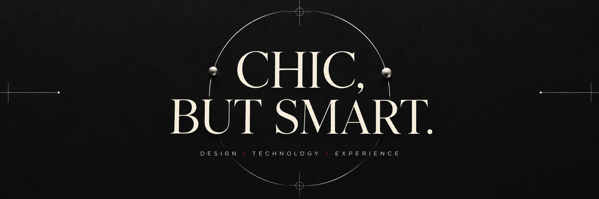
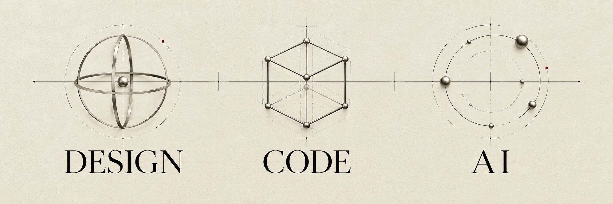
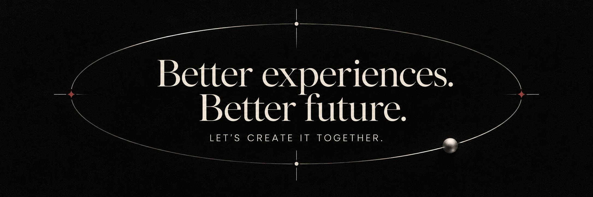

<!-- GitHub profile • hanarindc2-hash • Chic, but smart. -->
<!-- Keep the PNG files at the relative paths below when publishing. -->

  

<h1 align="center">For New World Creators.</h1>
<h3 align="center">Device Experience Developer</h3>

  Hello to everyone who dreams of a better world. 
  I’m a Device Experience Developer who shares that vision.

  <strong>Let’s build together — for better experiences and a better future.</strong>

  <a href="mailto:hanarindc2@gmail.com">EMAIL</a>
  &nbsp; / &nbsp;
  <a href="https://github.com/hanarindc2-hash">GITHUB</a>

 

<h2 align="center">01 / Design foundation</h2>

<!-- Large cell widths fill GitHub's available table area; CSS is not required. -->
<table align="center" width="100%">
  <tbody>
    <tr>
      <td align="center" valign="middle" width="5000">
         
        <strong>Industrial Experience Design</strong> 
        MAJOR · HANSUNG UNIVERSITY
          
      </td>
      <td align="center" valign="middle" width="5000">
         
        <strong>Game Graphic Design</strong> 
        MAJOR · HANSUNG UNIVERSITY
          
      </td>
    </tr>
  </tbody>
</table>

 

<h2 align="center">02 / Learning journey</h2>

<table align="center" width="100%">
  <tbody>
    <tr>
      <td align="center" valign="middle" width="10000">
         
        2020–2026 
        <strong>Hansung University, Korea</strong> 
        Industrial Experience Design &amp; Game Graphic Design
          
      </td>
    </tr>
    <tr>
      <td align="center" valign="middle" width="10000">
         
        2022 
        <strong>Capstone Design</strong> 
        Smart Mobility · Electronics · Healthcare
          
      </td>
    </tr>
    <tr>
      <td align="center" valign="middle" width="10000">
         
        2026–PRESENT 
        <strong>Hyundai AI Insight Campus</strong> 
        AI studies
          
      </td>
    </tr>
  </tbody>
</table>

 

  

<h2 align="center">03 / My toolkit</h2>

<!-- Tools I use, not proficiency ratings. -->
<table align="center" width="100%">
  <thead>
    <tr>
      <th align="center" width="2500">Area</th>
      <th align="center" width="7500">Tools I use</th>
    </tr>
  </thead>
  <tbody>
    <tr>
      <td align="center" valign="middle" width="2500"><strong>Design</strong></td>
      <td align="center" valign="middle" width="7500">Rhino · Photoshop · Illustrator Blender · Figma</td>
    </tr>
    <tr>
      <td align="center" valign="middle" width="2500"><strong>Programming</strong></td>
      <td align="center" valign="middle" width="7500">Python · C</td>
    </tr>
    <tr>
      <td align="center" valign="middle" width="2500"><strong>Collaboration</strong></td>
      <td align="center" valign="middle" width="7500">Notion · Figma · Slack</td>
    </tr>
    <tr>
      <td align="center" valign="middle" width="2500"><strong>AI</strong></td>
      <td align="center" valign="middle" width="7500">ComfyUI · GPT · Claude</td>
    </tr>
  </tbody>
</table>

 

<h2 align="center">04 / Let’s connect</h2>

<table align="center" width="100%">
  <tbody>
    <tr>
      <td align="center" valign="middle" width="10000">
         
        EMAIL 
        <a href="mailto:hanarindc2@gmail.com">hanarindc2@gmail.com</a>
          
      </td>
    </tr>
    <tr>
      <td align="center" valign="middle" width="10000">
         
        PHONE 
        <a href="tel:+821056316484">010-5631-6484</a>
          
      </td>
    </tr>
    <tr>
      <td align="center" valign="middle" width="10000">
         
        SOCIAL 
        Instagram · Behance · Threads · X
          
      </td>
    </tr>
  </tbody>
</table>

<!-- Social profile URLs were not supplied. Keep the names as plain text until available. -->

 

  

